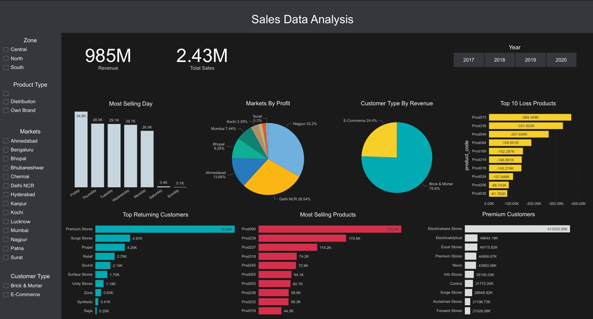

<h1>End-to-End Data Analysis Project on Sales Dataset</h1>

This case study is based on a computer hardware company that is struggling in a market that is constantly changing. The head of sales chooses to invest in a data analysis project and wants to create a Power BI dashboard that would provide him with real-time sales insights.

So, here are some questions that I'll try to provide insights into by answering these questions.

<ol>
    <li>Which days of the week do customers use to buy more?</li>
    <li>Top of the most selling products by category.</li>
    <li>Whose are our top customers by revenue?</li>
    <li>Which are our top returning customers?</li>
    <li>Which type of customers generated the most revenue?</li>
    <li>Which market is most profitable?</li>
    <li>Which zone is most well profitable?</li>
    <li>Which of our company's products don't do well on the market?</li>    
</ol>

Kaggle Notebook link: https://www.kaggle.com/abdunnoor11/sales-data-analysis

Power Bi Link: https://app.powerbi.com/view?r=eyJrIjoiYjAzMWZjMDctMjNjYy00NTQ0LThlMTctMzhkZmZiYzNjMGJjIiwidCI6IjZkMGIwZGQ1LTg2YmMtNGJhOC05NjMxLTZjZjM1ODA1M2I1YiIsImMiOjEwfQ%3D%3D

